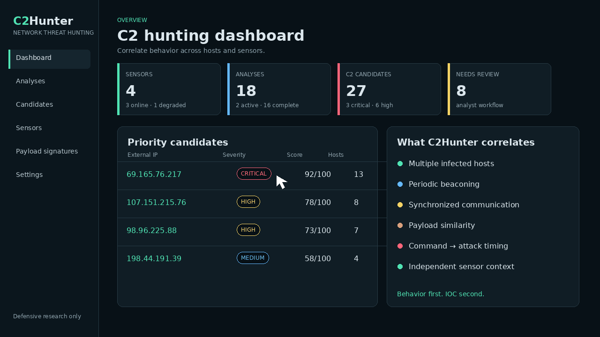
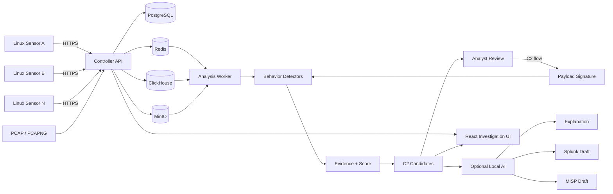
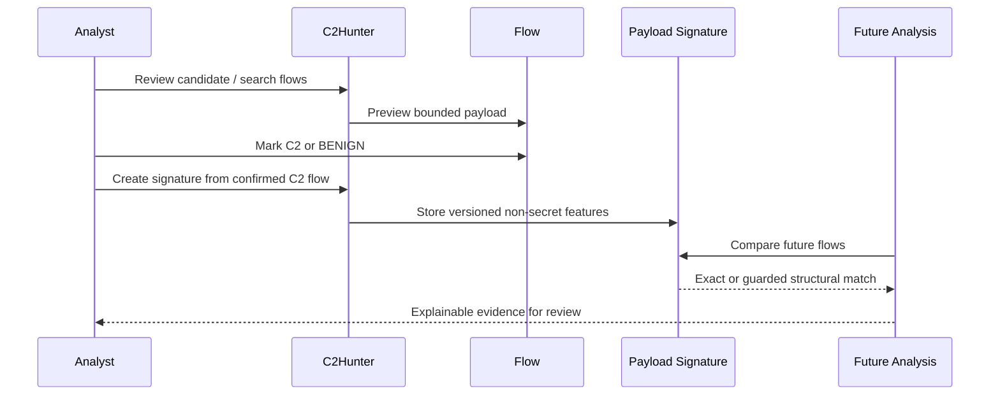

<div align="center">

# C2Hunter

### Hunt unknown C2 infrastructure from behavior — not just known IOCs.

**C2Hunter is an open-source network threat hunting platform that correlates live sensor traffic and offline PCAPs to detect, rank, and explain likely command-and-control infrastructure.**

[](https://github.com/piecer/c2hunter/actions/workflows/ci.yml)
[](https://github.com/piecer/c2hunter/stargazers)
[](https://github.com/piecer/c2hunter/commits/master)


<br />



<br />

**Live traffic · PCAP/PCAPNG · Multi-sensor correlation · Explainable scoring · Analyst-guided payload signatures · Optional local AI analysis**

[Quick Start](#quick-start) · [How It Works](#how-it-works) · [Detection Signals](#detection-signals) · [Architecture](#architecture) · [Documentation](#documentation)

</div>

---

## Why C2Hunter?

Traditional network detection is strongest when you already know what to look for: an IOC, signature, domain, IP, or protocol pattern.

C2Hunter is built for the harder question:

> **What if the C2 infrastructure is not known yet?**

Instead of treating each connection in isolation, C2Hunter looks for **behavior shared across hosts, time, payload characteristics, and independent sensors**.

```text
                        Traditional IOC detection

        Known IP / Domain / Signature
                    │
                    ▼
                 Match rule
                    │
                    ▼
                   Alert


                         C2Hunter

               Unknown destinations
                    │
                    ▼
              Network behavior
                    │
          ┌─────────┼─────────┐
          ▼         ▼         ▼
      Host       Time      Payload
   correlation  patterns   features
          │         │         │
          └─────────┼─────────┘
                    ▼
             Evidence scoring
                    │
                    ▼
              C2 candidates
                    │
                    ▼
              Analyst review
```

C2Hunter is designed for **defensive analysis**. It does not connect to candidate C2 servers, scan the Internet, decrypt TLS, replay malware commands, or reproduce attacks.

---

## What You Get

| Capability | What it does |
|---|---|
| **Multi-host correlation** | Finds external destinations shared by multiple internal hosts instead of judging a single flow alone. |
| **Periodic beacon detection** | Detects stable recurring communication patterns commonly associated with beaconing. |
| **Synchronized communication** | Identifies groups of hosts contacting the same destination at similar times. |
| **Multi-sensor context** | Correlates independent observations collected by distributed Linux sensors. |
| **Offline PCAP analysis** | Runs PCAP and PCAPNG files through the same normalization, detector, allowlist, and scoring pipeline. |
| **Explainable evidence** | Shows which detectors contributed to a candidate score and why. |
| **Human-guided detection** | Lets an analyst confirm a C2 flow and create a versioned payload signature for future analyses. |
| **Local AI analysis** | Optionally explains supporting/counter evidence and drafts Splunk hunting/detection queries and MISP data for analyst review. |
| **REST API** | Integrates with SIEM, SOAR, scripts, and other defensive workflows. |
| **PCAP evidence export** | Exports bounded candidate-related traffic for deeper investigation. |

---

## How It Works



The analysis pipeline is deliberately evidence-first:

```text
Packets
  ↓
Normalized flows
  ↓
Behavior / statistical detectors
  ↓
Evidence contributions
  ↓
Adjustments / allowlists
  ↓
Candidate score
  ↓
Analyst review
```

A score is a **review-priority signal**, not an attribution verdict.

---

## Detection Signals

C2Hunter can combine multiple independent signals instead of relying on one indicator.

| Signal | What C2Hunter looks for |
|---|---|
| **Common destination** | Multiple internal hosts contacting the same external destination |
| **Non-well-known port** | Repeated external communication over unusual service ports |
| **Periodic beacon** | Stable recurring intervals across repeated communication |
| **Single-host composite beacon** | Persistent low-volume beacon behavior from one host |
| **Synchronized communication** | Multiple hosts communicating within similar time windows |
| **Command → attack correlation** | Suspicious activity following likely command communication |
| **Persistence / rarity** | Long-lived communication with otherwise uncommon destinations |
| **Protocol / payload similarity** | Shared protocol and payload characteristics across hosts |
| **Multi-sensor context** | Independent observation from more than one sensor |
| **Analyst payload signature** | Exact or guarded structural match against analyst-confirmed payload features |
| **Population anomaly** | Candidate behavior that is unusual relative to other traffic in the same analysis |
| **TCP session quality** | Session-establishment evidence used to reduce low-quality TCP signals |

### Severity

| Score | Severity |
|---:|---|
| `80–100` | **CRITICAL** |
| `60–79` | **HIGH** |
| `40–59` | **MEDIUM** |
| `0–39` | **LOW** |

Review the evidence, affected internal hosts, independent sensor observations, timing, warnings, and packet context before escalation.

---

## Human-Guided Payload Detection

C2Hunter can turn analyst knowledge into reusable detection evidence.



Payload matching can use features such as:

- payload SHA-256
- prefix hash
- payload length
- entropy
- printable ratio
- SimHash

**Exact matches are high-confidence evidence. Structural similarity remains review-oriented.**

Completed analysis results stay immutable; reanalysis applies the current signature set to an existing dataset.

---

## Optional Local AI Analysis

C2Hunter's deterministic detectors remain the source of candidate evidence. The optional local LLM layer sits **after** that evidence pipeline.

It can help an analyst:

1. prioritize candidates,
2. explain supporting evidence,
3. explain counter-evidence and missing context,
4. propose additional verification steps,
5. draft Splunk hunting / scheduled-detection SPL,
6. draft MISP data for review.

```text
C2Hunter evidence bundle
        ↓
Local LLM
        ↓
┌──────────────────────────────┐
│ Candidate explanation        │
│ Supporting / counter factors │
│ Missing information          │
│ Verification guidance        │
│ Splunk SPL draft             │
│ MISP draft                   │
└──────────────────────────────┘
        ↓
Human approval
```

The AI layer is not allowed to auto-block traffic or automatically publish MISP data. A model failure must not break the underlying deterministic C2 analysis.

---

## Quick Start

### Requirements

Central server:

- Linux or WSL2
- Docker Engine `27+`
- Docker Compose `v2.30+`
- Python `3.12`
- Go `1.25.12`
- Node.js `22.14.0`
- npm `10+`

Suggested development host:

- 4 CPU
- 8 GiB RAM
- 20 GiB free disk

Reference benchmark host:

- 8 vCPU
- 16 GiB RAM
- NVMe storage

### Start C2Hunter

```bash
git clone https://github.com/piecer/c2hunter.git
cd c2hunter

cp .env.example .env
# Replace every change-me value in .env

make setup
make up
```

Verify the controller:

```bash
curl http://localhost:8000/api/v1/health
```

Open the UI:

```text
http://localhost:8080
```

> `C2HUNTER_DEV_LOGIN_ENABLED=true` is for isolated local development only. Do not expose the development login or Controller directly to the Internet.

---

## Analyze a PCAP

C2Hunter accepts classic PCAP and PCAPNG captures.

From the UI:

```text
Analysis history
    ↓
Upload PCAP
    ↓
Configure internal CIDRs
    ↓
Run analysis
    ↓
Review ranked candidates
    ↓
Inspect evidence / flows / PCAP
```

The default upload limits are:

- `500 MiB`
- `2,000,000` timestamped packets

Supported link types include Ethernet, raw IP, Linux cooked v1/v2, and loopback.

The binary API is available under:

```text
POST /api/v1/pcap-analysis-jobs
```

See [External API Reference](docs/external-api-reference.md) for request parameters and examples.

---

## Deploy External Sensors

Sensors run as independent Linux agents outside the central Docker Compose stack.

Build the sensor:

```bash
make sensor-agent
```

Install it on the sensor host:

```bash
tar -xzf artifacts/c2hunter-sensor-dev-linux-amd64.tar.gz
cd c2hunter-sensor

sudo ./install-sensor.sh \
  --controller-url https://c2hunter.example.com \
  --enrollment-token '<ONE_TIME_TOKEN>'

sudo systemctl start c2hunter-sensor
sudo systemctl status c2hunter-sensor
```

Each capture interface can be configured as:

- `INBOUND`
- `OUTBOUND`
- `BIDIRECTIONAL`
- `UNKNOWN`

The agent uses an independent AF_PACKET → Flow → spool → upload pipeline for each enabled interface, so an error on one interface does not need to stop all capture sources.

The installer creates a dedicated non-root user and limits packet-capture privileges to the required Linux capabilities.

---

## Analysis Lifecycle

Jobs move through a visible state machine:

```text
CREATED
   ↓
WAITING_FOR_SENSOR
   ↓
CAPTURING
   ↓
UPLOADING
   ↓
INGESTING
   ↓
ANALYZING
   ↓
COMPLETED / PARTIALLY_COMPLETED / FAILED / CANCELLED
```

Reanalysis creates a new run against the original immutable dataset rather than silently rewriting completed results.

---

## Architecture

C2Hunter separates capture, control, flow storage, object storage, queueing, and analysis.

```text
External Linux Sensors
        │
        │ outbound authenticated HTTPS
        ▼
┌──────────────────────────┐
│      Controller API      │◄──────── Browser / REST clients
└────────────┬─────────────┘
             │
     ┌───────┼───────────┬───────────┐
     ▼       ▼           ▼           ▼
PostgreSQL ClickHouse    MinIO      Redis
 metadata    flows       PCAP       queue
                                      │
                                      ▼
                               Analysis Worker
                                      │
                                      ▼
                         Detectors + Evidence + AI
```

The default Compose topology contains:

- Controller
- Analysis Worker
- React Web UI
- PostgreSQL
- Redis
- ClickHouse
- MinIO

It is a single-host development topology, not a production HA deployment.

---

## Security Boundaries

C2Hunter is designed as a defensive analysis platform.

It intentionally does **not**:

- connect to suspected C2 servers,
- actively scan Internet hosts,
- replay botnet or malware commands,
- decrypt TLS,
- automatically block traffic based on AI output,
- automatically publish MISP events based only on AI output.

For non-development deployments, keep the Controller private behind HTTPS ingress and configure role-based API token digests.

Roles:

| Role | Capability |
|---|---|
| `VIEWER` | Read |
| `ANALYST` | Investigations and finding management |
| `ADMIN` | Analyst capabilities plus sensor / detector management |

Static role tokens are a minimum deployment control, not a substitute for production identity, OIDC, MFA, or centralized session management.

---

## REST API

The API prefix is:

```text
/api/v1
```

Swagger UI:

```text
http://localhost:8000/docs
```

OpenAPI document:

```text
http://localhost:8000/openapi.json
```

C2Hunter can be integrated with SIEM, SOAR, scripts, and defensive research pipelines.

See the [External API Reference](docs/external-api-reference.md).

---

## Testing

```bash
make lint
make test
make test-unit
make test-integration
make test-e2e

make test-ai
make evaluate-ai
make benchmark-ai

make generate-test-pcaps
make benchmark-1m
```

The repository includes deterministic browser fixtures and generated PCAP scenarios for repeatable testing.

---

## Documentation

| Document | Purpose |
|---|---|
| [Architecture](docs/architecture.md) | Components, trust boundaries, and data flow |
| [Data Model](docs/data-model.md) | Core entities and stored data |
| [Detection Logic](docs/detection-logic.md) | Detector behavior and scoring |
| [Detection Adjustment Guidance](docs/detection-adjustment-guidance.md) | Tuning and detection guidance |
| [Custom Detectors](docs/custom-detectors.md) | Extending detection logic |
| [Human-Guided Detection](docs/human-guided-detection.md) | Analyst labels and payload signatures |
| [External API Reference](docs/external-api-reference.md) | REST integration |
| [Deployment](docs/deployment.md) | Deployment configuration |
| [Operations](docs/operations.md) | Operations and troubleshooting |
| [Security](docs/security.md) | Security assumptions and boundaries |
| [Dashboard Overview](docs/dashboard-overview.md) | Dashboard interpretation |
| [Local AI System](AI_C2_ANALYSIS_SYSTEM.md) | Evidence-first local AI architecture |

---

## Known Limitations

- Production OIDC/MFA and per-user distributed session management are not implemented.
- The default Compose deployment is not HA.
- TLS payloads are not decrypted.
- Payload retention is disabled by default.
- Packet-loss characteristics depend on the host kernel, NIC, mirror quality, capture filters, and privileges.
- A C2Hunter score is evidence for prioritization, not proof of malicious attribution.

---

## Contributing

Issues, reproducible PCAP scenarios, detector ideas, documentation improvements, and pull requests are welcome.

Useful contributions include:

- additional C2 behavioral detectors,
- false-positive reduction,
- protocol parsers,
- PCAP fixtures,
- performance benchmarks,
- SIEM/SOAR integrations,
- analyst workflow improvements.

If you found a bug, please include the analysis mode, relevant configuration, and a minimal reproducible capture or synthetic fixture when possible.

---

## Support the Project

If C2Hunter is useful for your threat-hunting, malware-analysis, SOC, or network-security work:

**⭐ Star the repository** — it helps other defenders discover the project.

You can also help by opening an issue with:

- a detection idea,
- a false-positive case,
- a reproducible PCAP scenario,
- a deployment report,
- or an integration you would like to see.

---

<div align="center">

### C2Hunter

**Behavior → Evidence → Candidate → Analyst**

Built for defensive network threat hunting.

</div>
